# Projeto Loja

O objetivo desse projeto é desenvolver uma aplicação simples para demonstrar a criação de uma API utilizando [Spring Boot](https://spring.io/) e a criação de uma interface utilizando [Angular](https://angular.io/). A aplicação consiste em um cadastro de lojas e funcionários. Uma loja pode conter uma ou vários funcionários de modo que cada funcionário pode pertencer somente a uma única loja. Na lista abaixo podemos ver a estrutura de classes do projeto:

	* Loja
		* Id: Integer
		* CNPJ: String com validador
		* Razão Social: String
		* Nome fantasia: String
		* Telefone: String
	* Funcionário
		* Nome: String
		* CPF: String com validador
		* Telefone: 1 ou mais
		* Email: String
		
Preparei um [vídeo](https://youtu.be/zXt22wRJhk0) de apresentação do sistema. Nesse vídeo é demonstrado todas as funcionalidades da aplicação. 

# Tecnologia utilizadas

No desenvolvimento da API foi utilizando a linguagem [Java](https://www.java.com/pt-BR/) com o frameword [Spring](https://spring.io/) e o banco de dados [PostgresSQL](https://www.postgresql.org/). Foi utilizado o serviço [ElephantSQL](https://www.elephantsql.com/) para criar uma instância na nuvem do nosso banco de dados. No desenvolvimento da interface visual foi utilizando o framework javascript [Angular](https://angular.io/) em conjunto com o framework css [MDBBootStrap](https://mdbootstrap.com/docs/angular/getting-started) e a biblioteca UI [Angular Material](https://material.angular.io/). 

# Configuração
 
Nesse breve tutorial estarei ensinando como instalar o ambiente de desenvolvimento, primeiro de tudo é preciso instalar o Node, acesse esse [link](https://nodejs.org/en/download/) para acessar a página oficial de download. O Node está disponível para Windows, Mac e Linux, no meu caso utilizo Windows. Com o Node instalado podemos utilizar o gerenciador de pacotes `NPM` para instalar os frameworks necessários. Para instalar o Angular precisamos digitar dois comandos: um para instalar a ferramenta de linha de comando do Angular e o outro para instalar o Typescript. Para tanto digite os seguintes comandos no seu terminal:
```
    npm install -g angular-cli
    npm install -g typescript
```

Após as instalações, basta inicializar o Angular utilizando o seguinte comando:
```
    ng serve
```
 
Precisamos agora instalar o Java, para isso acesse a [página](https://www.oracle.com/br/java/technologies/javase-downloads.html) de download do Java e em seguida execute o instalador. Após concluir a configuraçao do Java e do [Maven](https://maven.apache.org/), utilize o Git para clonar o projeto, em seguida carregue o diretório loja-api na IDE de sua preferência e por fím inicialize a aplicação.

# Interface visual
Nessa seção, faço a demonstração das principaies telas do sistema.

### Dashboard de Loja
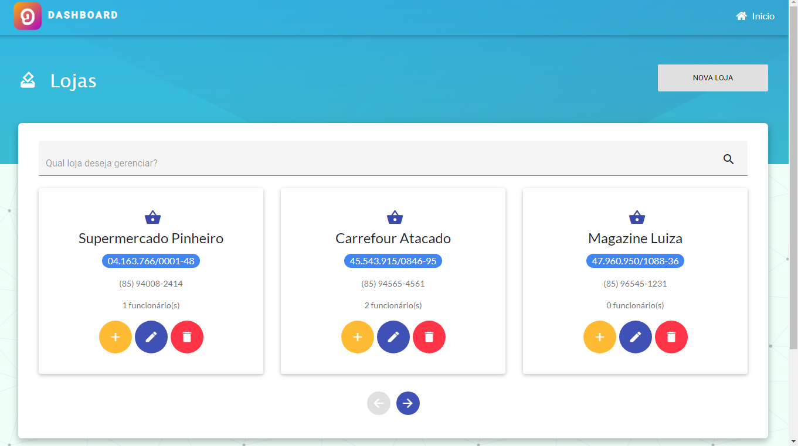
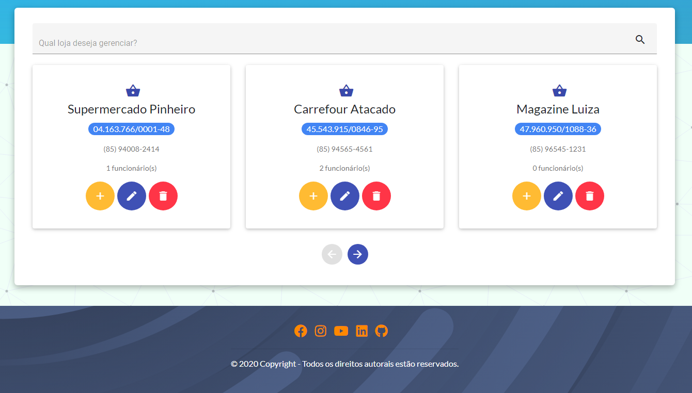

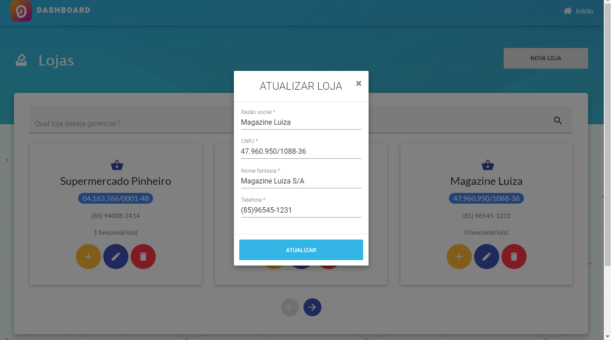
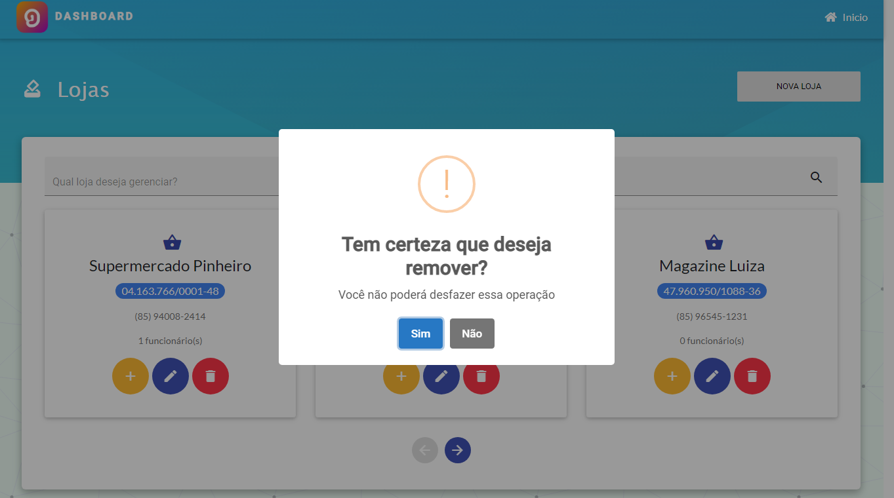
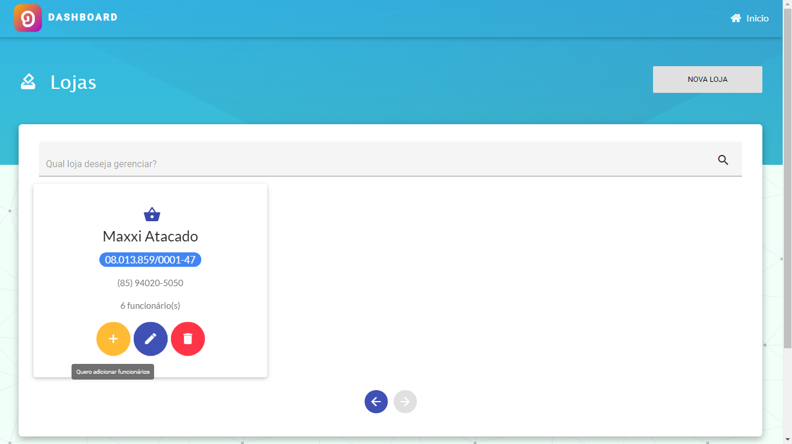

### Dashboard de Funcionário
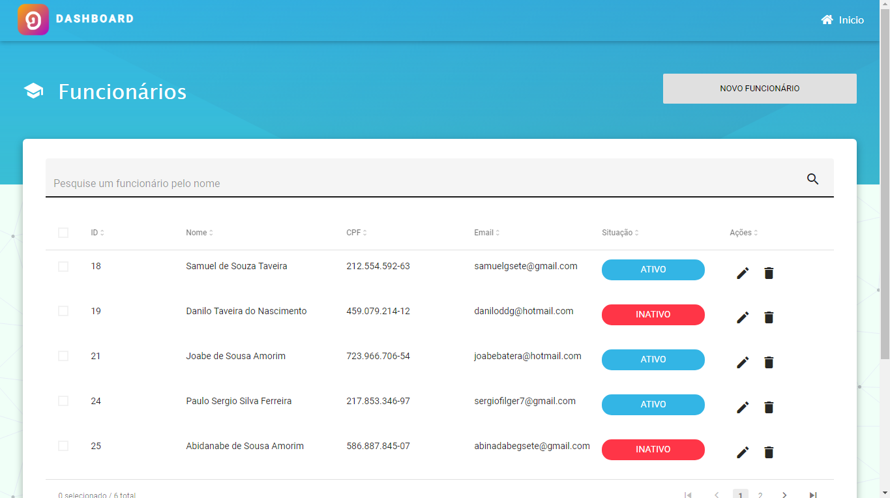
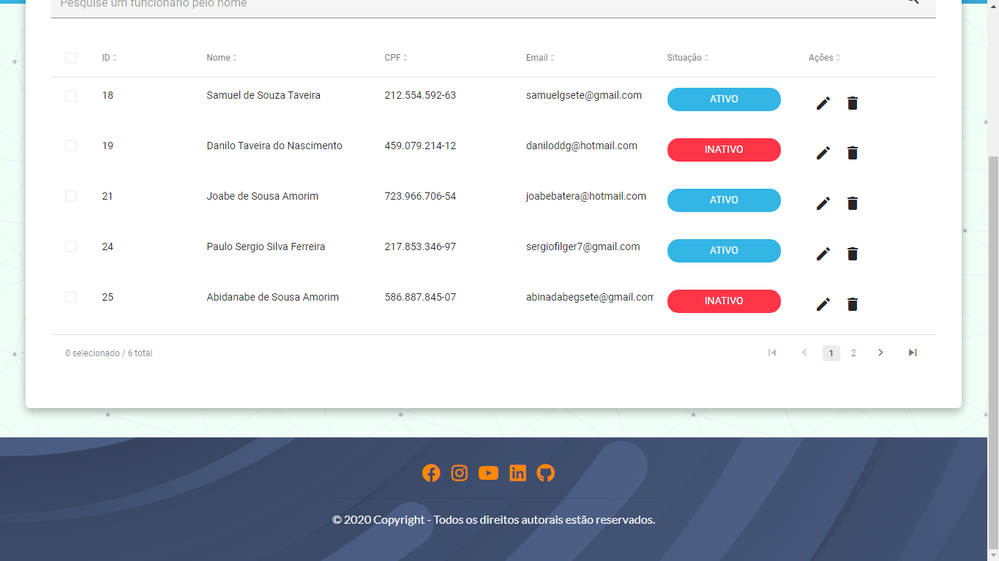
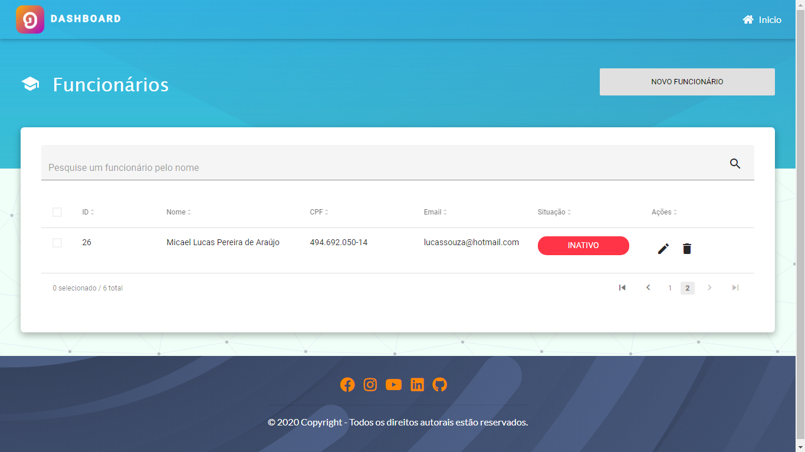
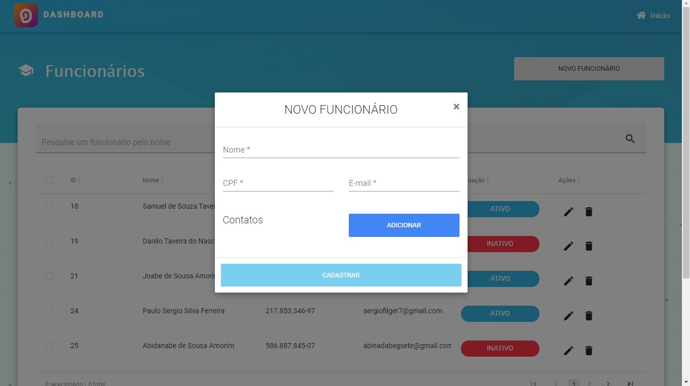
![Dashboard de Funcionário(capturas/dashboard-funcionario-5.png)
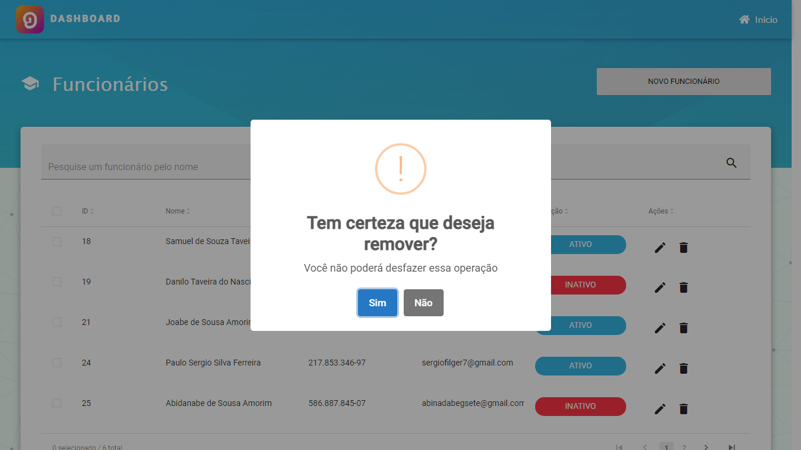

## Mensagens de alerta
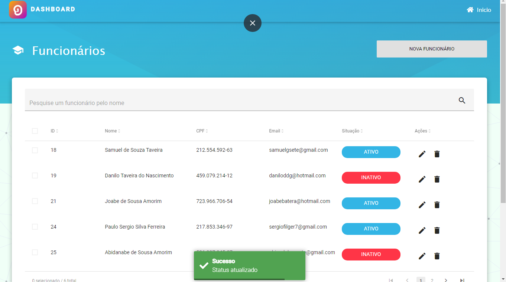
